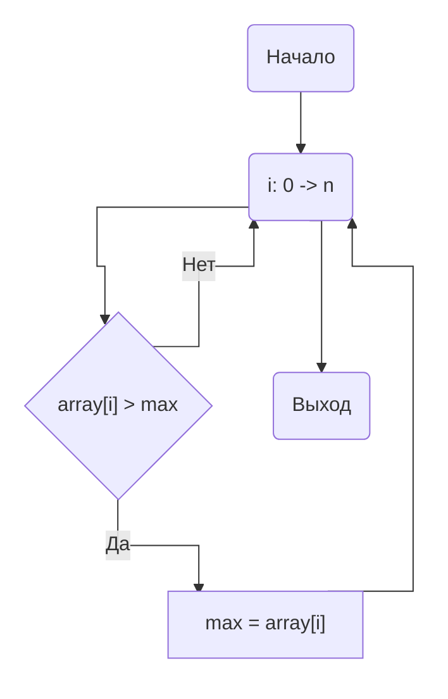

### НИЯУ МИФИ. Лаботаторная работа #1. Андрюнькин Захар, Б20-505

# Используемая система

```
CPU: 6-Core Intel Core i7-9750H (-MT MCP-) speed: 2592 MHz 
Kernel: 5.10.16.3-microsoft-standard-WSL2 x86_64 
Up: 4h 47m Mem: 377.1/7859.7 MiB (4.8%) Storage: 512.33 GiB (149.5% used) 
Procs: 10 Shell: bash 5.0.17 inxi: 3.0.38
```

**Сложность алгоритма - O(n/p)**

n - количество элементов массива

p - количество потоков



# Код
```
#include <stdio.h>
#include <stdlib.h>
#include <omp.h>

#define MROWS 100
#define CORE_LIMIT 6

int main(int argc, char** argv)
{
    const int count = 10000000;     ///< Number of array elements
    const int random_seed = 31337; ///< RNG seed

    int** matrix = 0;              ///< The array we need to find the max in
    int  max = -1;                ///< The maximal element
    double start, end;

    srand(random_seed);

    /* Generate the random MATRIX */
    matrix = (int**)calloc(MROWS, sizeof(int*));
    for (int i = 0; i < MROWS; i++) {
        matrix[i] = (int*)calloc(count, sizeof(int));
    }
    for (int i = 0; i < MROWS; i++) {
        for (int elem = 0; elem < count; elem++) {
            matrix[i][elem] = rand();
        }
    }
    char filename[50];
    sprintf(filename, "trace.txt");
    FILE *fp = fopen(filename, "w");
    if (fp == NULL) {
        printf("Can't open file\n");
        exit(1);
    }
    for (int thread = 1; thread <= CORE_LIMIT; thread++) {
        for (int row = 0; row < MROWS; row++) {
            max = -1;
            start = omp_get_wtime();
            #pragma omp parallel num_threads(thread) shared(matrix, count, row) reduction(max: max) default(none)
            {
                #pragma omp for
                for(int i=0; i<count; i++)
                {
                    if(matrix[row][i] > max) { 
                        max = matrix[row][i]; 
                    };
                }
            }
            end = omp_get_wtime();
            printf("CURR_THREAD = %d\n", thread);
            fprintf(fp, "%f;", end-start);
            
        }
        fprintf(fp, "\n");
    }
    fclose(fp);
    printf("Exit...\n");
    return(0);
}
```


<details>
  <summary>Code</summary>

    ```python
    # import matplotlib.pyplot as plt
    import seaborn as sns
    import pandas as pd
    sns.set_theme(style="darkgrid")

    dataset = []
    with open("trace.txt", "r") as f:
        for _ in range(6):
            line = list(map(float, f.readline().split(";")))
            dataset.append(line)
            
    for i in range(len(dataset)):
        line = dataset[i]
        line.sort()
        line = line[10:-10]
        dataset[i] = line
    ```
</details>

<details>
  <summary>Code</summary>

    ```python

    data = []
    for i, line in enumerate(dataset):
        data.append([i+1, (sum(line)/len(line))*1000, "Real"])
    saved = data.copy()
    data1 = data
    data_df = pd.DataFrame(data, columns=["Threads", "AvgTime", "Type"])
    for i in range(1, len(data1)): 
        data1[i] = [data1[i][0], data1[0][1] / data1[i][0], "Perfect"]
    data1[0][2] = "Perfect"
    # pdf = pd.DataFrame(data1, columns=["Threads", "AvgTime"])
    data1 = pd.DataFrame(data1, columns=["Threads", "AvgTime", "Type"])
    all_data = pd.concat([data1, data_df])
    ```

</details>

<details>
  <summary>Code</summary>

    ```python
    {
        "tags": [
            "hide-input",
        ]
    }
    p = sns.lineplot(x="Threads", y="AvgTime", hue="Type", marker="o", data=all_data)
    p.set_xlabel("Threads, num", fontsize = 16)
    p.set_ylabel("AvgTime, ms", fontsize = 16)
    l1 = p.lines[0]

    x1 = l1.get_xydata()[:, 0]
    y1 = l1.get_xydata()[:, 1]

    p.fill_between(x1, y1, color="blue", alpha=0.1)
    l2 = p.lines[1]

    x2 = l2.get_xydata()[:, 0]
    y2 = l2.get_xydata()[:, 1]

    p.fill_between(x2, y2, color="orange", alpha=0.05)
    p.margins(x=0, y=0)
    _ = p.set_xticks(range(0, 8))
    _ = p.set_xticklabels(['0', '1', '2', '3', '4', '5', '6', '7'])
    _ = p.set_yticks(range(0, 10))
    _ = p.set_yticklabels(['0', '1', '2', '3', '4', '5', '6', '7', '8', '9'])
    ```
</details>

    

    


<details>
  <summary>Code</summary>

    ```python
    {
        "tags": [
            "hide-input",
        ]
    }
    accceleration = [0] * 6
    for i in range(0, len(accceleration)):
        accceleration[i] = [saved[i][0], saved[0][1]/saved[i][1]]
    a_df = pd.DataFrame(accceleration, columns=["Threads", "TimesSpeed"])
    p = sns.lineplot(x="Threads", y="TimesSpeed", marker="o", data=a_df, color='g')
    p.set_xlabel("Threads, num", fontsize = 16)
    p.set_ylabel("TimesSpeed, times", fontsize = 16)
    l1 = p.lines[0]

    x1 = l1.get_xydata()[:, 0]
    y1 = l1.get_xydata()[:, 1]

    _ = p.fill_between(x1, y1, color="green", alpha=0.3)
    ```
</details>

    

    


<details>
  <summary>Code</summary>

    ```python
    {
        "tags": [
            "hide-input",
        ]
    }
    per_thread = [0] * 6
    for i in range(0, len(per_thread)):
        per_thread[i] = [accceleration[i][0], accceleration[i][1]/accceleration[i][0]]
    thr_df = pd.DataFrame(per_thread, columns=["Threads", "EfficencyPerThread"])
    p = sns.lineplot(x="Threads", y="EfficencyPerThread", marker="o", data=thr_df, color='b')
    p.set_xlabel("Threads, num", fontsize = 16)
    p.set_ylabel("EfficencyPerThread, times", fontsize = 16)
    l1 = p.lines[0]

    x1 = l1.get_xydata()[:, 0]
    y1 = l1.get_xydata()[:, 1]

    _ = p.fill_between(x1, y1, color="cyan", alpha=0.1)
    ```
</details>

    


## Заключение

В этой работе с использованием **OpenMP** в языке программирования **C** было проведено исследование эффективности многопоточности алгоритма поиска максимального элемента массива.
На машине было 6 реальных ядер, которые задествовала программа, а последующие являются виртуальными

**Вывод:**
- Реальный прирост от количества потоков уступает рассчётному
- Эффектиность виртальных потоков сильно падает по сравнению с реальными, что делает их использование нецелесообразным.
- Виртуальные потоки приводят к нестабильному приросту эффективности