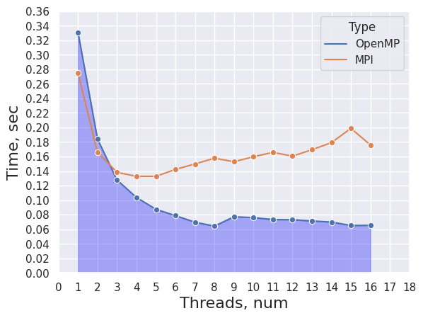
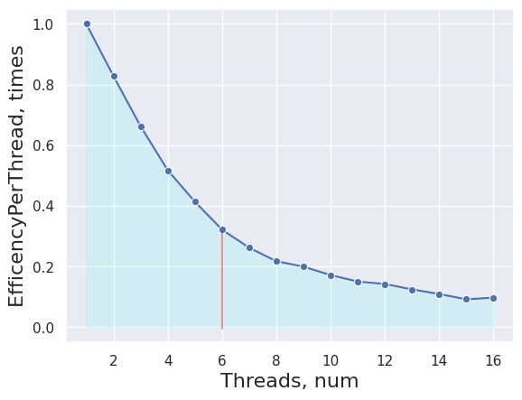

### НИЯУ МИФИ. Лаботаторная работа #6. Андрюнькин Захар, Б20-505

# Используемая система

```
CPU: 6-Core Intel Core i7-9750H (-MT MCP-) speed: 2592 MHz 
Kernel: 5.10.16.3-microsoft-standard-WSL2 x86_64 
Up: 4h 47m Mem: 377.1/7859.7 MiB (4.8%) Storage: 512.33 GiB (149.5% used) 
Procs: 10 Shell: bash 5.0.17 inxi: 3.0.38

MPI:
HYDRA build details:
    Version:                                 4.0
    Release Date:                            Fri Jan 21 10:42:29 CST 2022
```

# Код
```
#include <iostream>
#include <cstdlib>
#include <time.h>
#include "mpi.h"

using namespace std;

void shellSort(int* arr, int n)
{
    int stride = 0;
    for (stride = 1; stride < n / 3; stride = stride * 3 + 1);
    while(stride > 0)
    {
        for (int i = stride; i < n; i++)
        {
            int temp = arr[i];
            int j;
            for (j = i; j >= stride && arr[j - stride] > temp; j -= stride)
                arr[j] = arr[j - stride];

            arr[j] = temp;
        }
        stride = (stride - 1)/3;
    }
}


int main(int argc, char **argv) {
    int size, rank, arraySize = 1000000;
    int *array = new int[arraySize];
    const int random_seed = 920224;
    MPI_Status status;

    MPI_Init(&argc, &argv);
    MPI_Comm_size(MPI_COMM_WORLD, &size);
    MPI_Comm_rank(MPI_COMM_WORLD, &rank);

    srand(random_seed);

    if (rank == 0) {
        for (int i = 0; i < arraySize; i++) {
            array[i] = (rand() +rand() * RAND_MAX ) / 40;

        }
    }

    int *subArray;
    int n = arraySize / size;
    double begin;
    double end;

    if (rank == 0) {

        for (int i = 1; i < size; i++) {
            MPI_Send(array + n * (i - 1), n, MPI_INT, i, 0, MPI_COMM_WORLD);
        }

        begin = MPI_Wtime();
        int k = arraySize - n * (size - 1);
        subArray = new int[k];

        for (int i = n * (size - 1); i < arraySize; i++) {
            subArray[i - n * (size - 1)] = array[i];
        }
        shellSort(subArray, k);
        int *rArray = new int[arraySize];
        for (int i = 0; i < k; i++) {
            rArray[i] = subArray[i];
        }
        for (int i = 1; i < size; i++) {
            MPI_Recv(rArray + n * (i - 1) + k, n, MPI_INT, MPI_ANY_SOURCE, 1, MPI_COMM_WORLD, &status);
        }
        shellSort(rArray, arraySize);
        end = MPI_Wtime();
        cout << "" << (end - begin) << std::endl;
    }
    else
    {
        subArray = new int[n];
        MPI_Recv(subArray, n, MPI_INT, 0, 0, MPI_COMM_WORLD, &status);
        shellSort(subArray, n);
        MPI_Send(subArray, n, MPI_INT, 0, 1, MPI_COMM_WORLD);
    }

    MPI_Finalize();

    return 0;
}

```


```python
# REFACTOR DEFAULT VALUES FOR YOUR SYSTEM
CORE_LIMIT = 16
OLD_CUT = 5
NEW_CUT = 5
```

<details>
  <summary>Code</summary>
    ```python
    # import matplotlib.pyplot as plt
    import seaborn as sns
    import pandas as pd
    sns.set_theme(style="darkgrid")

    old_arr, cur_arr = [], []

    with open("old_trace.txt", "r") as fd:
        for _ in range(CORE_LIMIT):
            line = list(map(float, fd.readline().split(";")))
            line = sorted(line)[OLD_CUT:-OLD_CUT]
            avg_value = (sum(line) / len(line))
            old_arr.append(avg_value)
    with open("trace.txt", "r") as fd:
        for i in range(CORE_LIMIT):
            line = list(map(float, fd.readline().split(";")))
            line = sorted(line)[NEW_CUT:-NEW_CUT]
            avg_value = (sum(line) / len(line))
            cur_arr.append(avg_value)

    ```


    ```python
    # Create DataFrames
    old_predf = [[index+1, avg_time, "OpenMP"] for index, avg_time in enumerate(old_arr)]
    cur_predf = [[index+1, avg_time, "MPI"] for index, avg_time in enumerate(cur_arr)]
    old_df = pd.DataFrame(old_predf, columns=["Threads", "Time", "Type"])
    cur_df = pd.DataFrame(cur_predf, columns=["Threads", "Time", "Type"])

    all_df = pd.concat([old_df, cur_df])
    # all_df
    ```


    ```python
    # Time(Thread) graph
    p = sns.lineplot(x="Threads", y="Time", hue="Type", marker="o", data=all_df)
    p.set_xlabel("Threads, num", fontsize = 16)
    p.set_ylabel("Time, sec", fontsize = 16)
    l1 = p.lines[0]

    x1 = l1.get_xydata()[:, 0]
    y1 = l1.get_xydata()[:, 1]
    _ = p.fill_between(x1, y1, color="blue", alpha=0.3)
    p.margins(x=0, y=0)
    _ = p.set_xticks(range(0, CORE_LIMIT+3))
    _ = p.set_xticklabels([str(i) for  i in range(CORE_LIMIT+3)])
    _ = p.set_yticks([val*0.02 for val in range(19)])
    ```
</details>


    

    


<details>
  <summary>Code</summary>
    ```python
    acceleration = [0] * CORE_LIMIT
    for i in range(0, CORE_LIMIT):
        acceleration[i] = [i+1, (cur_arr[0]/cur_arr[i])]
        

    a_df = pd.DataFrame(acceleration, columns=["Threads", "TimesSpeed"])
    p = sns.lineplot(x="Threads", y="TimesSpeed", marker="o", data=a_df, color='g')
    p.set_xlabel("Threads, num", fontsize = 16)
    p.set_ylabel("TimesSpeed, times", fontsize = 16)
    l1 = p.lines[0]

    x1 = l1.get_xydata()[:, 0]
    y1 = l1.get_xydata()[:, 1]

    _ = p.fill_between(x1, y1, color="green", alpha=0.3)
    _ = p.axvline(x=8, ymin=0.04, ymax=0.8, color="red", alpha=0.4)
    ```
</details>

    

    


<details>
  <summary>Code</summary>
    ```python
    per_thread = [0] * CORE_LIMIT
    for i in range(0, len(per_thread)):
        per_thread[i] = [acceleration[i][0], acceleration[i][1]/acceleration[i][0]]
    thr_df = pd.DataFrame(per_thread, columns=["Threads", "EfficencyPerThread"])
    p = sns.lineplot(x="Threads", y="EfficencyPerThread", marker="o", data=thr_df, color='b')
    p.set_xlabel("Threads, num", fontsize = 16)
    p.set_ylabel("EfficencyPerThread, times", fontsize = 16)
    l1 = p.lines[0]

    x1 = l1.get_xydata()[:, 0]
    y1 = l1.get_xydata()[:, 1]

    _ = p.fill_between(x1, y1, color="cyan", alpha=0.1)
    _ = p.axvline(x=6, ymin=0.04, ymax=0.33, color="red", alpha=0.4)
    ```
</details>

    

    


## Заключение

В этой работе я ознакомился с разработкой алгоритмов параллельной сортировки при помощи технологии **MPI**. Было проведено сравнение алгоритмов сортировки Шелла на **OpenMP** и **MPI**.

**Вывод:** Технология MPI всё ещё показывает сравнительно худший результат. Но поскольку алгоритм сортировки гораздо затратнее чем поиск максимального элемента (в предыдущей лабораторной работе), то можно сделать вывод, что для сортировок операции пересылки данных между потоками играют меньшую роль => технология MPI практичнее использовать для более трудозатратных операций.
